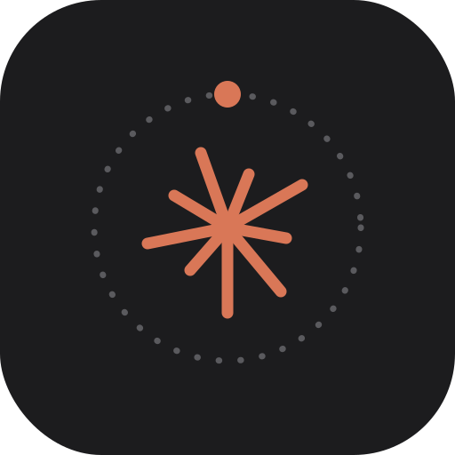

<div align="center">
  
  <h1>ClaudeQ</h1>
  <p>Queue Claude Code tasks during the day, run them at night.</p>
</div>

ClaudeQ is a small, local-only macOS app. During the day you add tasks — a prompt
and a working folder — to a queue. A background daemon runs them with the
[Claude Code](https://claude.com/claude-code) CLI overnight, when your usage
allowance has reset, and you review the results in the morning.

Everything stays on your Mac: tasks, settings, and run history live under
`~/Library/Application Support/claudeq`, and the daemon listens only on loopback.

## How it works

- You queue tasks in a native menu-bar app. Each task is a **prompt** plus the
  **folder** it should run in.
- A launchd background daemon watches the queue and runs due tasks with the
  Claude Code CLI in headless mode.
- If a run hits the **rate limit**, ClaudeQ pauses the whole queue and resumes
  the same session once the limit clears — no work is lost.
- To keep running past a scheduled sleep, it can wake the Mac with `pmset`.
- Results — success or failure — land in **Activity**, optionally with a
  notification.

## Features

- **Three ways to schedule a task**
  - *As soon as possible* — runs on the next opportunity (typically the nightly window).
  - *Earliest start* — not before a specific date/time.
  - *Cron* — recurring, on a cron schedule (e.g. `0 20 * * *`).
- **Concurrency control** — one task at a time by default; mark a task *parallel*
  to let it run alongside others.
- **Per-task overrides** — model, permission handling, and whether to notify on
  the result — over your global defaults.
- **Self-queueing** — a running task can schedule follow-up tasks itself, so a
  prompt can say things like *"if you find something to optimize, queue it as a
  separate task instead of doing it now."* From inside a run, Claude uses
  `claudeq queue --prompt "…"` with an optional `--at` / `--in` / `--cron` time
  and `--dir`; model, permissions, parallel and notify settings are inherited
  from the calling task.
- **Rate-limit aware** — reactive gate with automatic session resume.
- **Notifications** — native macOS notifications, and optional
  [Pushover](https://pushover.net) push to your phone.
- **Usage insight** — tokens, runs, and API-equivalent cost per day (what the
  same work would have cost via the API).
- **Unattended-safe** — kills hung runs (no output for too long), recovers
  orphaned runs after a crash, and prunes old history to bound disk use.
- **Native macOS** — its own app window, Dock icon, menu bar, and system accent
  color; nothing but the Claude Code CLI leaves your machine.

## Install

1. Download the latest `claudeq-<version>.pkg` from the
   [Releases](https://github.com/danielmaier42/claudeq/releases) page.
2. Open it and follow the installer.

The package installs **ClaudeQ** to `/Applications` and sets up a per-user
LaunchAgent so the daemon starts at login. Open **ClaudeQ** from Applications to
start adding tasks.

> The package is not notarized, so on first launch macOS may warn that it is from
> an unidentified developer. Right-click **ClaudeQ → Open**, then confirm — or
> allow it under **System Settings → Privacy & Security**.

To run tasks past a scheduled sleep, ClaudeQ can schedule a wake with `pmset`,
which needs one sudoers entry (the daemon prints the exact line on install).

## Using it

1. **New task** — give it a prompt, pick the working folder, and choose a
   trigger (as-soon-as-possible, earliest start, or cron). Optionally override
   the model or enable *parallel* / *notify on result*.
2. Leave it queued. The daemon runs it at the scheduled time (or overnight).
3. Check **Activity** for the outcome; open **Log** to see the full run, or
   re-run a task from there. Filter by date range and page through history.
4. **Usage** shows your consumption over the last 14 days.

**Settings** covers global defaults (model, permissions), the Claude binary path
(the daemon can't see your shell `PATH`, so this is pre-filled by detection), the
scheduler check interval, the idle-run timeout, how much history to keep, and
Pushover credentials.

## Uninstall

```sh
/Applications/ClaudeQ.app/Contents/MacOS/claudeqd uninstall   # remove the LaunchAgent
sudo rm -f /etc/sudoers.d/claudeq                             # remove the pmset wake permission
rm -rf /Applications/ClaudeQ.app
```

Or run [`scripts/uninstall.sh`](scripts/uninstall.sh) (does all of the above).
Your tasks and history in
`~/Library/Application Support/claudeq` are left in place; delete that folder to
remove them too.

## Build from source

Requires Go 1.26+ and `librsvg` (`brew install librsvg`) for icon rendering.

```sh
scripts/build-app.sh    # build/ClaudeQ.app        (double-click or `open` it)
scripts/build-pkg.sh    # dist/claudeq-<version>.pkg (installer)
```

Releases are built automatically: pushing a `v*` tag runs
[`.github/workflows/release.yml`](.github/workflows/release.yml), which builds the
`.pkg` on macOS and attaches it to the GitHub Release.

## Requirements

- macOS 12 or newer
- The [Claude Code](https://claude.com/claude-code) CLI, installed and
  authenticated

## License

[MIT](LICENSE) © 2026 Daniel Maier
